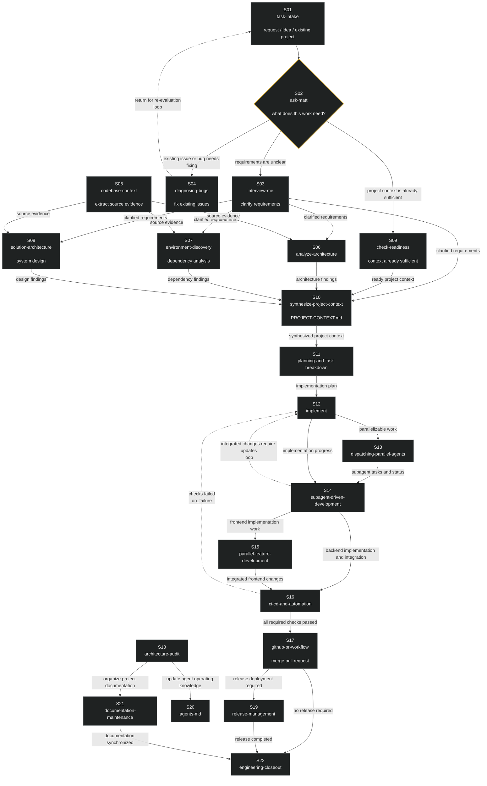

# Software Agent SOP — Engineering Workflow as an Executable Graph

**English** | [简体中文](README.zh-CN.md)


**A complete software-engineering agent workflow shipped as an executable graph: 22 skill nodes, 33 explicit edges, an 11-gate CI-runnable validator, and a resume-capable runner protocol.**

Typical agent workflows live as prose guides: the agent reads the advice, then decides for itself what to do, what to skip, and in what order. When a task spans requirement gathering, implementation, verification, and release — a dozen-plus stages — that discretion is exactly where things break: steps get skipped, "done" cannot be verified, and an interrupted run has to be reconstructed from chat history.

This repository ships the workflow itself as a **first-class engineering artifact** instead. `workflow.yaml` declares nodes and edges — order, dependencies, gates, branches, feedback loops — *before* execution. Prose tells the agent what it *could* do. A graph tells it what *must* happen, and what already did.

> ```text
> Agent:  "I'll handle it in whatever order feels right."
> SOP:    "No. The 33 edges were defined before you started."
>         validate → schedule → execute → record → route
>         state.json is the only memory the run trusts.
> ```

## What goes wrong without it

| The failure | Without an executable graph | With this SOP |
|---|---|---|
| You're a solo developer and don't know where to start | Stare at an empty repo, start wherever feels right, drift | The graph defines the entry and the route: S01 receives the request, S02 classifies it — clarify it, fix it, or move on |
| You don't know what a software project actually involves | Skip requirement clarification, skip analysis, skip verification, ship, never close out | The 22-slot order *is* engineering best practice, fixed as topology: a node cannot run until its dependencies passed |
| Nobody reviews your work | "It works on my machine" is the only gate | S16 is a hard gate (CI as external verifier) and S18 is an independent audit axis — a built-in reviewer for a team of one |
| A long run is interrupted | Reconstruct from chat history | `.workflow/state.json` persists every node's status — a fresh session resumes from checkpoints, not from memory |
| Parallel sub-agents step on each other | Merge conflicts, overwritten files | Parallelism only for nodes with disjoint file sets (measured rule) |
| A trivial request takes the full pipeline | Every task costs 22 steps | S02 routes by "what does this work need" — trivial work exits early |

## Who this is for

| You are | The decision you face | What this SOP does |
|---|---|---|
| **Solo developer / indie dev** | One person wearing product, engineering, testing, and release hats — with no team process and no one to review your work | A packaged team-grade workflow: follow the graph and you get requirement clarification, evidence-driven analysis, verification gates, audit, and closeout — the discipline of a senior team, without needing a team |
| **AI agent builder** | Assemble a full-lifecycle workflow from scratch — or adopt this complete graph? | A complete reference graph: intake → evidence → plan → parallel implementation → CI gate → merge/release → audit → closeout, with the parallel-subagent layer and independent audit axis already wired |
| **Hermes / Claude / Codex user** | Copy 31 skills one by one — or clone one repo? | 31 self-contained skill directories; clone the repo, copy what you need |

## Why this SOP

1. **The graph is the product, not the nodes.** A single skill is a tool — `interview-me` knows how to clarify, `diagnosing-bugs` knows how to fix, `release-management` knows how to ship. The graph is the *process*: it decides when each tool is used, in what order, and what counts as done. To someone who doesn't know how a software project should run, each skill answers "how do I do this step" — the graph answers "how do I get through the whole project". That is the capability no single node has.
2. **Structure and content are separated.** The graph owns *sequencing*; the 22 skills own *content*. Swap a node's skill, re-route an edge, or run the same graph on a different project — the definition stays declarative, and neither side invades the other.
3. **The graph is testable, not trusted.** `validate-workflow.py` enforces 11 gates — topology, edge semantics, gate completeness, cycle policy, skill existence — and is CI-runnable. An invalid graph cannot be executed. Positive and negative test cases are bundled (4/4 pass).
4. **Execution is resumable.** The runner protocol schedules in topological order, passes artifacts between nodes, honors gates/branches/loops, and persists state to `.workflow/state.json` — a crashed or interrupted run restarts from disk, not from chat.
5. **The cost controller is built in.** Node S02 is a router: it classifies the work first, and trivial requests bypass the full pipeline. The graph is a state machine with an on-ramp that knows when *not* to run.
6. **Zero dependencies, fully portable.** The graph format is plain YAML and the validator is pure Python stdlib. Nothing binds the workflow to a model, vendor, or harness — the runner protocol references generic mechanisms (background sub-agents, skill loading, clarify-style prompts), with Hermes tool names given only as examples.

## The graph



## The 22 slots

| # | Node skill | Role | # | Node skill | Role |
|---|---|---|---|---|---|
| S01 | task-intake | intake | S12 | implement | executor |
| S02 | ask-matt | router (cost controller) | S13 | dispatching-parallel-agents | parallel detection |
| S03 | interview-me | clarify requirements | S14 | subagent-driven-development | orchestration (review gate: requesting-code-review) |
| S04 | diagnosing-bugs | fix existing issues | S15 | parallel-feature-development | stream integration |
| S05 | codebase-context | extract source evidence | S16 | ci-cd-and-automation | hard verify gate |
| S06 | analyze-architecture | current-state analysis | S17 | github-pr-workflow | merge |
| S07 | environment-discovery | constraint analysis | S18 | architecture-audit | independent audit |
| S08 | solution-architecture | target design | S19 | release-management | release |
| S09 | check-readiness | context-sufficient bypass | S20 | agents-md | agent knowledge |
| S10 | synthesize-project-context | synthesis hub | S21 | documentation-maintenance | human docs |
| S11 | planning-and-task-breakdown | plan | S22 | engineering-closeout | closeout |

## Verify it, then use it

```bash
# 1. Validate the graph — the gate everything runs through
python workflow-definition/scripts/validate-workflow.py workflow.yaml
#    expect: workflow: software-agent-workflow v1.0.0 (nodes=22, edges=33, final=S22) → VALID

# 2. Run the validator's own test suite (positive + negative cases)
python workflow-definition/scripts/test-validate-workflow.py
#    expect: RESULT: 4/4 passed

# 3. Also verify every node's skill resolves to an installed skill
python workflow-definition/scripts/validate-workflow.py workflow.yaml --skills-dir /path/to/skills
```

To execute the graph, follow the `workflow-runner` protocol node by node (validate → topo-schedule → execute each node via its skill → carry artifacts → route gates/branches/loops → persist state → resume on interruption → close with `engineering-closeout`).

To use the skills directly: clone the repo and copy any skill directory into your agent's skill library — each directory is self-contained (`SKILL.md` plus its scripts/templates/references).

## What it deliberately does NOT do

- **Not a runtime engine.** The repository ships the graph definition, the validator, and the runner *protocol* — scheduling semantics as an executable specification. It does not ship a program that executes the graph for you.
- **Not a fixed recipe.** The 22 slots are a reference mapping, not dogma. `agent-workflow-engineering` exists precisely so you can rebuild the graph for your own domain — the methodology is the product, the specific graph is the worked example.
- **Not a replacement for CI.** The S16 gate *uses* your CI as the external verifier. If you don't run CI, the gate degrades to a checklist — the discipline, not the machinery, is what it enforces.
- **Not bound to one harness.** The graph format and validator are plain YAML + stdlib Python. The runner protocol references generic mechanisms with Hermes tool names given only as examples.

## Structure

```
workflow.yaml        the 22-slot graph: nodes + edges + gate/loop semantics (v1.0.0)
workflow-guide.md    full graph in mermaid + phase-by-phase reading
workflow-definition/ graph schema + validate-workflow.py (11 gates) + tests + templates
workflow-runner/     scheduler protocol: topo order, artifacts, gates, state, resume
agent-workflow-engineering/  methodology: build workflows for your own domain (7 phases, gate per phase)
task-intake/ …       31 skill directories (one per slot, plus dependencies)
```

## License

MIT — see [LICENSE](LICENSE). Skills bundled from third-party sources (mattpocock/skills, addyosmani/agent-skills, obra/superpowers, wshobson/agents, claudskills.com) retain their original licenses.
