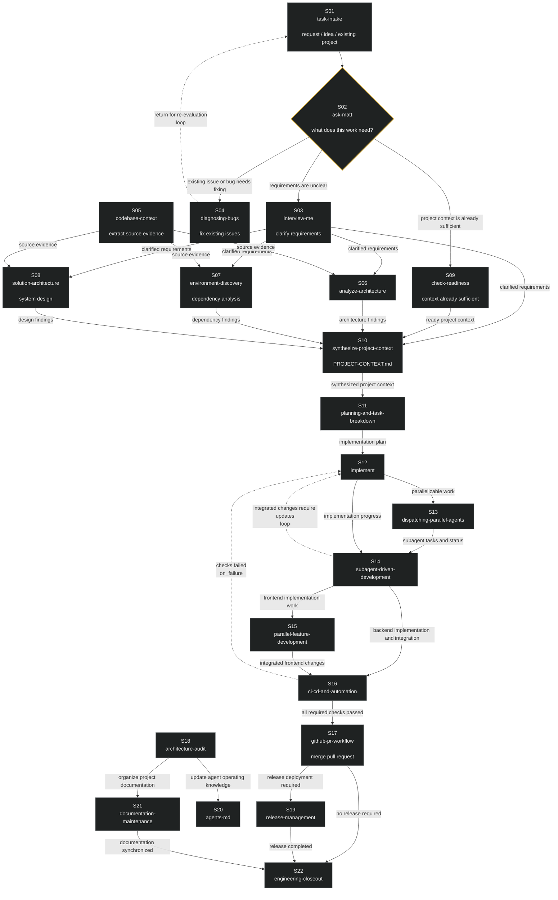

# Software Agent SOP —— 可执行图定义的软件工程 Agent 工作流

**English** | [简体中文](README.zh-CN.md)


**一套完整的软件工程 Agent 工作流，以可执行图的形式交付：22 个技能节点、33 条显式边、11 道可挂 CI 的校验门禁、支持断点续跑的执行协议。**

典型的 Agent 工作流是散文指南：Agent 读到建议，然后自己决定做什么、跳过什么、按什么顺序。当任务横跨需求、实现、验证、发布十几个环节时，这种自由裁量正是故障来源——关键步骤被跳过、"完成"无法核实、中断的运行只能从聊天记录里重建。

本仓库把工作流本身做成**一等工程工件**。`workflow.yaml` 在运行前声明节点与边——顺序、依赖、门禁、分支、反馈回路。散文告诉 Agent 它*可以*做什么；图告诉它*必须*发生什么、已经发生了什么。

> ```text
> Agent:  "我按自己觉得顺手的顺序来。"
> SOP:    "不行。33 条边在你开工前就定义好了。"
>         validate → schedule → execute → record → route
>         state.json 是整次运行唯一信任的记忆。
> ```

## 没有它会怎样

| 故障 | 没有可执行图 | 有了这套 SOP |
|---|---|---|
| 你是独立开发者，不知道从哪开始 | 对着空仓库发呆、凭感觉开工、越做越偏 | 图定义了入口和路径：S01 接收请求 → S02 分类路由——该澄清的澄清、该修的修、该继续的继续 |
| 你不清楚一个软件项目到底包含什么 | 跳过需求澄清、跳过分析、跳过验证，直接交付，从不收尾 | 22 个槽位的顺序*就是*工程最佳实践，固化为拓扑：依赖未通过的节点根本无法运行 |
| 没有人审查你的工作 | "在我机器上能跑"就是唯一门禁 | S16 硬门禁（CI 作为外部验证者）+ S18 独立审计轴——一个人开发时内置的 reviewer |
| 长任务中途被打断 | 从聊天记录里猜 | `.workflow/state.json` 持久化每个节点的状态——新会话从检查点恢复，不从记忆恢复 |
| 并行子代理互相踩踏 | 合并冲突、文件被覆盖 | 只有文件集不重叠的节点才允许并行（实测规则） |
| 琐碎请求走了全流程 | 每件小事都花 22 步 | S02 按"这个工作需要什么"路由——琐碎任务提前退出 |

## 为谁而做

| 你是谁 | 你面对的选择 | 这套 SOP 做什么 |
|---|---|---|
| **独立开发者（solo dev / indie）** | 一个人身兼产品、工程、测试、发布，没有团队流程，也没有人审你的代码 | 一条打包好的团队级流程：照图执行，就得到需求澄清、证据驱动分析、验证门禁、审计、收尾的完整纪律——资深团队的流程，不需要团队 |
| **AI Agent 构建者** | 从零拼一条全生命周期工作流——还是采纳这张完整的图？ | 一张完整参考图：intake → 证据 → 计划 → 并行实现 → CI 门禁 → 合并/发布 → 审计 → 收尾，并行子代理层和独立审计轴都已接好 |
| **Hermes / Claude / Codex 用户** | 一个个复制 31 个技能——还是克隆一个仓库？ | 31 个自包含技能目录；克隆仓库，按需复制 |

## 为什么是它

1. **图才是产品，节点不是。** 单个技能是工具——`interview-me` 知道怎么澄清，`diagnosing-bugs` 知道怎么修，`release-management` 知道怎么发布。图是*流程*：它决定每个工具何时被使用、按什么顺序、什么算完成。对不知道软件项目该怎么开展的人来说，每个技能回答"这一步怎么做"，图回答"整个项目怎么走完"——这是任何单节点都不具备的能力。
2. **结构与内容分离。** 图拥有*顺序*，22 个技能拥有*内容*。换掉某个节点的技能、改一条边的路由、把同一张图用在另一个项目上——定义始终是声明式的，两边互不侵入。
3. **图是可测试的，不是靠信任的。** `validate-workflow.py` 强制 11 道门禁——拓扑、边语义、门禁完备性、回路策略、技能存在性——可挂 CI。非法图无法执行。正负向测试用例随仓附带（4/4 通过）。
4. **执行是可续跑的。** runner 协议按拓扑序调度、节点间传递 artifact、处理门禁/分支/回路、把状态持久化到 `.workflow/state.json`——崩溃或中断的运行从磁盘恢复，不靠聊天记录。
5. **成本控制器内置。** 节点 S02 是路由器：先给工作分类，琐碎请求绕过全流程。这是一台知道*什么时候不该跑*的状态机。
6. **零依赖、完全可移植。** 图格式是纯 YAML，校验器是纯 Python 标准库。工作流不绑定任何模型、厂商或 harness——runner 协议引用通用机制（后台子代理、技能加载、clarify 式提问），Hermes 工具名只作为示例出现。

## 图



## 22 个槽位

| # | 节点技能 | 角色 | # | 节点技能 | 角色 |
|---|---|---|---|---|---|
| S01 | task-intake | 入口 | S12 | implement | 执行 |
| S02 | ask-matt | 路由（成本控制器） | S13 | dispatching-parallel-agents | 并行识别 |
| S03 | interview-me | 需求澄清 | S14 | subagent-driven-development | 编排（评审门：requesting-code-review） |
| S04 | diagnosing-bugs | 修复既有问题 | S15 | parallel-feature-development | 并行流整合 |
| S05 | codebase-context | 提取源码证据 | S16 | ci-cd-and-automation | 硬验证门禁 |
| S06 | analyze-architecture | 现状分析 | S17 | github-pr-workflow | 合并 |
| S07 | environment-discovery | 约束分析 | S18 | architecture-audit | 独立审计 |
| S08 | solution-architecture | 目标设计 | S19 | release-management | 发布 |
| S09 | check-readiness | 上下文就绪旁路 | S20 | agents-md | Agent 知识 |
| S10 | synthesize-project-context | 综合枢纽 | S21 | documentation-maintenance | 人类文档 |
| S11 | planning-and-task-breakdown | 计划 | S22 | engineering-closeout | 收尾 |

## 先验证，再用

```bash
# 1. 校验图——一切运行的门禁
python workflow-definition/scripts/validate-workflow.py workflow.yaml
#    期望: workflow: software-agent-workflow v1.0.0 (nodes=22, edges=33, final=S22) → VALID

# 2. 跑校验器自带的测试套件（正负向）
python workflow-definition/scripts/test-validate-workflow.py
#    期望: RESULT: 4/4 passed

# 3. 额外校验每个节点的 skill 都能解析到已安装技能
python workflow-definition/scripts/validate-workflow.py workflow.yaml --skills-dir /path/to/skills
```

执行图：按 `workflow-runner` 协议逐节点走（validate → 拓扑调度 → 逐节点加载技能执行 → artifact 传递 → 门禁/分支/回路路由 → 状态持久化 → 中断恢复 → 以 `engineering-closeout` 收尾）。

直接用技能：克隆仓库，把任意技能目录复制进你的 Agent 技能库——每个目录自包含（`SKILL.md` + 其 scripts/templates/references）。

## 它刻意不做什么

- **不是运行时引擎。** 本仓库交付图定义、校验器和 runner *协议*（可执行的调度语义规范），不交付替你执行图的程序。
- **不是固定配方。** 22 个槽位是参考映射，不是教条。`agent-workflow-engineering` 的存在正是为了让你为自己的领域重建这张图——方法论是产品，这张具体图是工作示例。
- **不是 CI 的替代品。** S16 门禁*使用*你的 CI 作为外部验证者。没有 CI 时门禁退化为清单——它强制的是纪律，不是机器。
- **不绑定单一 harness。** 图格式和校验器是纯 YAML + 标准库 Python。runner 协议引用通用机制，Hermes 工具名只作为示例出现。

## 结构

```
workflow.yaml        22 槽位图：节点 + 边 + 门禁/回路语义（v1.0.0）
workflow-guide.md    mermaid 全图 + 分阶段解读
workflow-definition/ 图模式 + validate-workflow.py（11 道门禁）+ 测试 + 模板
workflow-runner/     调度协议：拓扑序、artifacts、门禁、状态、恢复
agent-workflow-engineering/  方法论：为自己的领域构建工作流（7 个阶段，每阶段一道门禁）
task-intake/ …       31 个技能目录（每槽位一个，含依赖）
```

## 许可

MIT —— 见 [LICENSE](LICENSE)。随仓附带的第三方来源技能（mattpocock/skills、addyosmani/agent-skills、obra/superpowers、wshobson/agents、claudskills.com）保留其原始许可。
