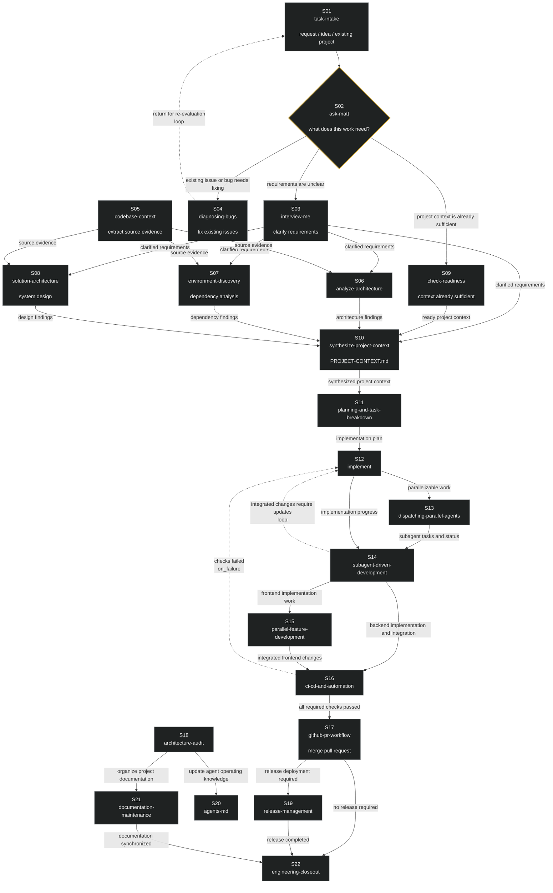

# The Consolidated AI-Agent Workflow (22-Slot SOP) — Guide

> Version: workflow.yaml v1.0.0 (22 nodes / 33 edges)
> Core assets: `workflow.yaml` (this directory) + the `workflow-definition` / `workflow-runner` / `agent-workflow-engineering` skills (shipped as directories in this repository)

---

## 1. What This Is

A 22-node software-engineering agent SOP graph, solidified into an **executable graph definition**:

- **Graph (structure)**: `workflow.yaml` — nodes + explicit edges (order/dependency/condition defined before execution)
- **Nodes (content)**: 22 independent skills — each node is an executable unit, strictly decoupled from the graph
- **Validation (tests)**: the `validate-workflow.py` script in `workflow-definition` — 11 gates, CI-runnable
- **Execution (scheduling)**: `workflow-runner` — topological order, artifact passing, gates/branches/loops, state persistence with checkpoint recovery

## 2. The Full Graph (mermaid)



(Dashed edges = dynamic edges: `loop` feedback edges and `on_failure` failure-return edges — the cycle check permits only these two kinds; any other cycle = validation failure.)

## 3. Phase-by-Phase Reading

| Layer | Nodes | Design Intent |
|---|---|---|
| **1. INTAKE** | S01→S02 | Entry is unclassified (request / idea / existing project all enter); **S02 is the cost controller** — routes by "what does this work need", so trivial tasks never traverse the full graph |
| **2. UNDERSTAND** | S03/S04/S09 | Requirements clarification (structured output) / bug fixing (returns to S01 for re-evaluation when done) / ready-context bypass |
| **3. CONTEXT** | S05→S10 | **Evidence first** (S05 extracts citable facts from the codebase) → three orthogonal views (S06 current state / S07 constraints / S08 target) → **S10 convergence hub**: all local facts synthesized into a single project state (PROJECT-CONTEXT.md) |
| **4. PLAN** | S11 | Understanding → executable plan, explicitly marking **parallelizable tasks** (triggers the subagent layer) |
| **5. EXECUTE** | S12→S15 | Main implementation → parallel detection (S13) → orchestration (S14, with an **integration feedback loop** back to S12) → parallel-stream integration (S15) |
| **6. VERIFY** | S16 | **Hard gate**: CI is the external verifier — "self-reported completion is a hypothesis, the gate is the test"; failure flows back along `on_failure` to S12 (execution-grounded recovery) |
| **7. CLOSEOUT** | S17→S22 | After merge, dual exit (no release → straight to closeout / release needed → S19) → S22 closeout archive; **S18 independent audit axis** (zero in-degree, runs in parallel) maintains machine knowledge (AGENTS.md) and human documentation, also converging into closeout |

## 4. How to Run

```
# 1. Validate (gate: must pass before running)
python workflow-definition/scripts/validate-workflow.py workflow.yaml
#    add --skills-dir PATH to also verify every node's skill resolves to an installed skill

# 2. Execute (per the workflow-runner protocol)
#    validate -> topological scheduling -> per-node (load the skill and execute) -> artifact passing
#    -> gates/branches/loops -> .workflow/state.json persistence (checkpoint recovery)
#    -> bounded retry on failure -> S22 produces the closeout report
```

## 5. Engineering Quality (Four Properties)

1. **Explicit structure**: 33 edges are defined before execution; scheduling does not depend on the agent's free will
2. **Structure/content separation**: the graph file vs the 22 skills — neither invades the other
3. **Executable semantics**: the runner's scheduling protocol (topology / gates / branches / loops / state / recovery)
4. **First-class engineering artifact**: version-controlled; the validator is CI-runnable (positive and negative cases both tested); state.json is monitorable
